# Client-Side Repeater DataGrid <!-- omit in toc -->

## Contents <!-- omit in toc -->
1. [Basic Setup Overview](#basic-setup-overview)
2. [Version](#version)
3. [Setup](#setup)
   1. [Application Setup](#application-setup)
   2. [Global Scripts](#global-scripts)
      1. [ClientSideRepeaterDataGrid Script](#clientsiderepeaterdatagrid-script)
      2. [ClientSideRepeaterDataGridState Script](#clientsiderepeaterdatagridstate-script)
      3. [ClientSideRepeaterDataGridGetData Script](#clientsiderepeaterdatagridgetdata-script)
   3. [Types](#types)
      1. [Column](#column)
      2. [State](#state)
      3. [DataSet](#dataset)
   4. [Page](#page)
      1. [Container](#container)
      2. [Grid](#grid)
      3. [Repeater](#repeater)
      4. [Labels](#labels)
4. [Script Usage](#script-usage)
   1. [ClientSideRepeaterDataGrid](#clientsiderepeaterdatagrid)
   2. [ClientSideRepeaterDataGridState](#clientsiderepeaterdatagridstate)
   3. [ClientSideRepeaterDataGridGetData](#clientsiderepeaterdatagridgetdata)
5. [CSS](#css)
6. [Optional Features](#optional-features)
7. [Upgrading Stadium Repos](#upgrading-stadium-repos)

## Overview
Using a *Repeater* control to display data allows for more flexibility, customisability and extensbility than a standard DataGrid. This module provides the functionality to sort and page through a DataSet assigned to a *Repeater*. 

Examples are also provided on how to achieve a variety of other common DataGrid functions. 

https://github.com/user-attachments/assets/c6d7890c-16b5-456d-a71e-f92b6a701da3

# Basic Setup Overview

1. Add the [ClientSideRepeaterDataGrid](#clientsiderepeaterdatagrid-script) script
2. Add the [types](#types)
3. Add the [controls](#page) to your Page
4. Create the [Page.Load](#pageload-event-handler) event handler
5. Use the [ClientSideRepeaterDataGrid](#ClientSideRepeaterDataGrid) in the Page.Load event handler

Check out the included sample application or the [Repeater DataGrid](https://github.com/stadium-software/repeater-datagrid) repo to find out how to add some more advanced features

# Version
1.1 Added an optional callback parameter for a page script that can be called after the assignment of the data

1.2 Added "Classic" paging option; added "No data" display for empty datasets

1.3 Fixed callback script caller

1.4 Removed double no data message when empty set

1.5 Fixed null string value sorting bug

1.6 Updated readme to 6.12+; converted px to rem; fixed display bugs

1.7 Added support for retrieving repeater data

1.7.1 Replaced "Editable Grid" feature with [ClientSideRepeaterDataGridGetData script](#clientsiderepeaterdatagridgetdata-script)

1.7.1.1 Bug fix visually-hidden css

1.8 Added check for Repeater control

2.0 Included styles in the script & removed need to include "stadium-client-side-repeater-datagrid.css" in EmbeddedFiles for v6.12+

2.1 Added 'Infinite' scroll as a paging option

# Setup

## Application Setup
1. Check the *Enable Style Sheet* checkbox in the application properties

## Global Scripts
The module requires the script called ["ClientSideRepeaterDataGrid"](#ClientSideRepeaterDataGrid-script) below to set up the *Repeater* contol as a DataGrid. 

In order to query the state of the *Repeater*, the second script called ["ClientSideRepeaterDataGridState"](#ClientSideRepeaterDataGridstate-script) is also needed. This is useful if you, for example, want to return the *Repeater* to a specific state later. 

### ClientSideRepeaterDataGrid Script
1. Create a Global Script called "ClientSideRepeaterDataGrid"
2. Add the input parameters below to the Global Script
   1. Columns
   2. ContainerClass
   3. Data
   4. RepeaterControlName
   5. State
   6. PagingType
   7. Callback
3. Drag a *JavaScript* action into the script
4. Add the Javascript below unchanged into the JavaScript code property
```javascript
/* Stadium Script v2.1 https://github.com/stadium-software/repeater-datagrid-client-side */
let scope = this;
loadCSS();
let data = ~.Parameters.Input.Data || [];
let cols = ~.Parameters.Input.Columns || [];
let state = ~.Parameters.Input.State || {};
let callback = ~.Parameters.Input.Callback;
let pageSize = parseInt(state.pageSize);
let sortField = state.sortField || cols[0].name;
let sortDirection = state.sortDirection || "";
let pagingType = ~.Parameters.Input.PagingType || "default";
pagingType = pagingType.toLowerCase();
let page = parseInt(state.page) || 1;
let pagers = 10;
let totalRecords = data.length;
let repeaterName = ~.Parameters.Input.RepeaterControlName;
if (isNaN(page)) page = 1;
let totalPages = Math.ceil(totalRecords / pageSize);
let containerClass = ~.Parameters.Input.ContainerClass;
if (!containerClass) {
     console.error("The ContainerClass parameter is required");
     return false;
}
if (!scope[`${repeaterName}`]) {
     console.error("The Repeater was not found");
     return false;
}
scope[`${repeaterName}List`] = [];
let container = document.querySelectorAll("." + containerClass);
if (container.length == 0) {
    console.error("The class '" + containerClass + "' is not assigned to any container");
    return false;
} else if (container.length > 1) {
    console.error("The class '" + containerClass + "' is assigned to multiple containers");
    return false;
}
container = container[0];
container.classList.add("stadium-client-side-dg-repeater");
let grid = container.querySelectorAll(".grid-layout");
if (grid.length == 0) {
    console.error("The container '" + containerClass + "' must contain a Grid control");
    return false;
} else if (grid.length > 1) {
    console.error("The container '" + containerClass + "' must contain only one Grid control");
    return false;
}
grid = grid[0];
let infinitePaging = false;
let infiniteScrollEnd = false;
if (pagingType == "infinite") {
    infinitePaging = true;
}
if (infinitePaging) {
    var infiniteObserver = new IntersectionObserver(entries => {
        if (entries[0].isIntersecting) {
            page++;
            setRepeaterData(page, data);
        }
    }, {
            rootMargin: '0px 0px 100px 0px'
    });
}
let contID = container.id;
let cellsPerRow = cols.length;
let tries = 0;
let wait = async (milliseconds) => new Promise((resolve) => setTimeout(resolve, milliseconds));
let scriptCaller = async (script, parameters) => {
    tries++;
    if (tries > 20) {
    	return false;
    } else {
        try {
            await scope[script](data);
            return true;
        } catch (error) {
            wait(100).then(() => scriptCaller(script, parameters));
        }
    }
};
if (document.getElementById(contID + "_stylesheet")) document.getElementById(contID + "_stylesheet").remove();
attachStyling();
addHeaders(cols);
addPaging();
sort(sortField, sortDirection);
let cells = container.querySelectorAll(".grid-repeater-item");
let rowNo = 1, cellCounter = 0;
for (let i = 0; i < cells.length; i++) {
    cellCounter++;
    cells[i].setAttribute("row-no", rowNo);
    if (cellCounter >= cellsPerRow) {
        cellCounter = 0;
        rowNo++;
    }
}
/*----------------------------------------------------------------------------------------------*/
async function setRepeaterData(p, d) {
    let pageData = scope[`${repeaterName}List`];
    let pageNo = (p - 1) * pageSize;
    let pageSlice = d.slice(pageNo, pageNo + pageSize);
    if (infinitePaging) {
        infiniteObserver.observe(container.querySelector(".paging"));
        if (!infiniteScrollEnd && pageSlice.length > 0) {
            pageData.push(...pageSlice);
        } else if (!infiniteScrollEnd && pageSlice.length == 0) {
            infiniteScrollEnd = true;
        } else {
            pageData = d;
        }
    } else {
        pageData = pageSlice;
    }
    await attachData(pageData);
    if (infinitePaging && getDistanceFromBottom(grid) > 0) {
        page = page + 1;
        setRepeaterData(page, data);
    }
    writeCookie();
    if (callback) await scriptCaller(callback, d);
}
function attachData(value) {
    scope[`${repeaterName}List`] = [];
    scope[`${repeaterName}List`] = value;
}
function writeCookie() {
    let value = JSON.stringify({
        "pageSize": pageSize,
        "page": page,
        "sortDirection": sortDirection,
        "sortField": sortField
    });
    let options = {
        secure: true,
        samesite: "strict",
        domain: window.location.hostname,
    };
    let updatedCookie = encodeURIComponent(contID) + "=" + encodeURIComponent(value);
    for (let optionKey in options) {
        updatedCookie += "; " + optionKey;
        let optionValue = options[optionKey];
        if (optionValue !== true) {
            updatedCookie += "=" + optionValue;
        }
    }
    document.cookie = updatedCookie;
}
function addHeaders(c) { 
    let headers = container.querySelectorAll(".repeater-header");
    for (let i = 0; i < headers.length; i++) {
        headers[i].remove();
    }
    for (let i = c.length-1; i > -1; i--) {
        let gItem = createTag("div", ["grid-item", "repeater-header"], []);
        let el = createTag("div"), inner;
        if (c[i].header && c[i]?.sortable !== false && c[i]?.sortable !== "false") {
            el = createTag("div", ["control-container", "link-container"]);
            inner = createTag("a", ["btn", "btn-lg", "btn-link"], [{name: "rel", value:"noopener noreferrer"}, {name: "field", value:c[i].name}], c[i].header);
            inner.addEventListener("click", handleSort);
            el.appendChild(inner);
        } else if (c[i].header) { 
            el = createTag("div", ["control-container", "label-container"]);
            inner = createTag("span", [], [], c[i].header);
            el.appendChild(inner);
        }
        if (c[i]?.visible == false || c[i]?.visible == 'false') el.classList.add("visually-hidden");
        if (c[i].name == sortField && sortDirection.toLowerCase() == "asc") el.classList.add("dg-asc-sorting");
        if (c[i].name == sortField && sortDirection.toLowerCase() == "desc") el.classList.add("dg-desc-sorting");
        gItem.appendChild(el);
        grid.insertBefore(gItem, grid.firstChild);
    }
}
function addPaging() { 
    if (container.querySelector(".paging")) container.querySelector(".paging").remove();
    let pagingContainer = createTag("div", ["layout-control", "container-layout", "paging", "inline-block-element", "data-grid-container"], []);
    if (pagingType == "classic") {
        let pagingButtonsContainer = createTag("ul", ["pagination"], []);
        let pagingButtons = addClassicPagingButtons(pagingButtonsContainer, page);
        pagingContainer.appendChild(pagingButtons);
    } else if (pagingType == "default") {
        let prevButtonContainer = createTag("div", ["control-container", "button-container", "previous-button"], []);
        let prevButton = createTag("div", ["btn", "btn-lg", "btn-default"], [], "<<");
        let nextButtonContainer = createTag("div", ["control-container", "button-container", "next-button"], []);
        let nextButton = createTag("div", ["btn", "btn-lg", "btn-default"], [], ">>");
        let goInputContainer = createTag("div", ["control-container", "text-box-container", "specific-page"], []);
        let goInput = createTag("input", ["form-control", "error-border", "text-box-input", "specific-page-input"], [{name: "type", value: "text"}]);
        let goButtonContainer = createTag("div", ["control-container", "button-container", "specific-page-go"], []);
        let goButton = createTag("div", ["btn", "btn-lg", "btn-default"], [], "Go");
        let pageInfoContainer = createTag("div", ["control-container", "label-container", "page-info"]);
        let pageInfo = createTag("span", [], [], getPageLabel());
        if (page == 1 || data.length == 0) prevButtonContainer.classList.add("disabled");
        if (page == totalPages || data.length == 0) nextButtonContainer.classList.add("disabled");
        prevButtonContainer.appendChild(prevButton);
        nextButtonContainer.appendChild(nextButton);
        goInputContainer.appendChild(goInput);
        goButtonContainer.appendChild(goButton);
        pageInfoContainer.appendChild(pageInfo);

        pagingContainer.appendChild(prevButtonContainer);
        pagingContainer.appendChild(nextButtonContainer);
        pagingContainer.appendChild(goInputContainer);
        pagingContainer.appendChild(goButtonContainer);
        pagingContainer.appendChild(pageInfoContainer);

        prevButton.addEventListener("click", function(){
            handlePaging("previous");
        });
        nextButton.addEventListener("click", function(){
            handlePaging("next");
        });
        goButton.addEventListener("click", function(){
            handlePaging("go");
        });
        goInput.addEventListener("keypress", function (e) {
            if ((e.keyCode < 48 || e.keyCode > 57)) {
                e.preventDefault();
            }
            if (e.keyCode === 13) {
                handlePaging("go");
            }
        });
    }
    let stackLayout, allStacks = container.querySelectorAll(".stack-layout-container");
    for (let i = 0; i < allStacks.length; i++) {
        if (allStacks[i].contains(grid) && allStacks.length > i) {
            stackLayout = allStacks[i + 1];
        }
    }
    if (!stackLayout) {
        stackLayout = createTag("div", ["stack-layout-container"]);
        container.appendChild(stackLayout);
    }
    stackLayout.classList.add('paging-stack-layout');
    stackLayout.insertBefore(pagingContainer, stackLayout.firstChild);
}
function handlePaging(tp) { 
    let nextBtn = container.querySelector(".next-button"),
        prevBtn = container.querySelector(".previous-button"),
        goInpt = container.querySelector(".specific-page-input"),
        pageInfo = container.querySelector(".page-info span"),
        fire = false;
    if (tp == "next" && page < totalPages) {
        page++;
        fire = true;
    }
    if (tp == "previous" && page > 1) {
        page--;
        fire = true;
    }
    if (tp == "go" && goInpt.value) {
        let pgVal = goInpt.value;
        if (pgVal) pgVal = pgVal.replaceAll(",","").replaceAll(" ","");
        goInpt.value = "";
        if (!isNaN(pgVal) && pgVal >= 1 && pgVal <= totalPages) {
            page = parseInt(pgVal);
            fire = true;
        }
    }
    if (fire) {
        nextBtn.classList.remove("disabled");
        prevBtn.classList.remove("disabled");
        if (page == 1) prevBtn.classList.add("disabled");
        if (page == totalPages) nextBtn.classList.add("disabled");
        pageInfo.textContent = getPageLabel();
        setRepeaterData(page, data);
    }
}
function addClassicPagingButtons(parent, currentPage) {
    currentPage = currentPage - 1;
    let firstPage = currentPage - (currentPage % 10);
    let lastPage = firstPage + pagers;
    parent.innerHTML = "";
    if (totalPages < lastPage) lastPage = totalPages;
    if (firstPage >= pagers) {
        let pagingButton = createTag("li", [], []);
        let pagingButtonInner = createTag("a", [], [], "«");
        pagingButtonInner.addEventListener("click", handleClassicPaging);
        pagingButton.appendChild(pagingButtonInner);
        parent.appendChild(pagingButton);
    }
    for (let i = firstPage; i < lastPage; i++) {
        let pagingButton = createTag("li", [], []);
        if (i == currentPage) pagingButton.classList.add('active');
        let pagingButtonInner = createTag("a", [], [], i + 1);
        pagingButtonInner.addEventListener("click", handleClassicPaging);
        pagingButton.appendChild(pagingButtonInner);
        parent.appendChild(pagingButton);
    }
    if (totalPages > (firstPage + pagers)) {
        let pagingButton = createTag("li", [], []);
        let pagingButtonInner = createTag("a", [], [], "»");
        pagingButtonInner.addEventListener("click", handleClassicPaging);
        pagingButton.appendChild(pagingButtonInner);
        parent.appendChild(pagingButton);
    }
    return parent;
}
function handleClassicPaging(ev) {
    let el = ev.target;
    let elParent = el.closest("li");
    if (el.classList.contains("active")) {
        return false;
    }
    let paging = container.querySelector(".paging");
    let pagination = container.querySelector(".pagination");
    paging.querySelector(".active").classList.remove("active");
    let pg = el.textContent;
    if (pg == "»") {
        page = page % 10 === 0 ? page + 1 : page + pagers - (page % 10) + 1;
        if (page > totalPages) page = totalPages - (totalPages % 10) + 1;
        let pagingButtons = addClassicPagingButtons(pagination, page);
        paging.appendChild(pagingButtons);
    } else if (pg == "«") {
        page = page % 10 === 0 ? page - pagers : page - (page % 10);
        let pagingButtons = addClassicPagingButtons(pagination, page);
        paging.appendChild(pagingButtons);
    }
    else {
        page = Number(pg);
        elParent.classList.add("active");
    }
    setRepeaterData(page, data);
}
function handleSort(e) { 
    let clickedEl = e.target;
    let colHead = clickedEl.getAttribute("field");
    let dir = "asc";
    if (clickedEl.closest(".dg-asc-sorting")) {
        dir = "desc";
    }
    sort(colHead, dir);
}
function sort(field, direction) {
    if (data && data.length > 0) {
        if (!["asc", "desc"].includes(direction.toLowerCase())) direction = "asc";
        let allHeaders = container.querySelectorAll(".repeater-header .link-container");
        for (let i = 0; i < allHeaders.length; i++) {
            allHeaders[i].classList.remove("dg-asc-sorting", "dg-desc-sorting");
            if (allHeaders[i].querySelector("a") && allHeaders[i].querySelector("a").getAttribute("field").toLowerCase() == field.toLowerCase()) {
                allHeaders[i].classList.add("dg-" + direction + "-sorting");
            }
        }
        sortDirection = direction;
        sortField = field;
        if (typeof data[0][sortField] == "string" && direction == "asc") {
            data.sort(function (a, b) {
                if (a[sortField] && b[sortField]) return a[sortField].localeCompare(b[sortField]);
            });
        }
        if (typeof data[0][sortField] == "string" && direction == "desc") {
            data.sort(function (a, b) {
                if (a[sortField] && b[sortField]) return b[sortField].localeCompare(a[sortField]);
            });
        }
        if (typeof data[0][sortField] == "number" && direction == "asc") {
            data.sort((a, b) => a[sortField] - b[sortField]);
        }
        if (typeof data[0][sortField] == "number" && direction == "desc") {
            data.sort((a, b) => b[sortField] - a[sortField]);
        }
        if (typeof data[0][sortField] == "boolean" && direction == "asc") {
            data.sort((a, b) => b[sortField] - a[sortField]);
        }
        if (typeof data[0][sortField] == "boolean" && direction == "desc") {
            data.sort((a, b) => Number(a[sortField]) - Number(b[sortField]));
        }
    }
    if (infinitePaging) {
        page = 1;
        infiniteScrollEnd = false;
        scope[`${repeaterName}List`] = [];
    }
    setRepeaterData(page, data);
}
function createTag(type, arrClasses, arrAttributes, text) {
    let el = document.createElement(type);
    if (arrClasses && arrClasses.length > 0) {
        arrClasses = arrClasses.filter(function( element ) { return element !== undefined; });
        let cl = el.classList;
        cl.add.apply(cl, arrClasses);
    }
    if (arrAttributes && arrAttributes.length > 0) { 
        for (let i = 0; i < arrAttributes.length; i++) { 
            if (arrAttributes[i].name) el.setAttribute(arrAttributes[i].name, arrAttributes[i].value);
        }
    }
    if (text) el.textContent = text;
    return el;
}
function getPageLabel() {
    let pgLabel = "No records found";
    if (totalPages > 0) {
        pgLabel = "Page " + page.toLocaleString() + " of " + totalPages.toLocaleString();
    }
    return pgLabel;
}
function getDistanceFromBottom(element) {
  const rect = element.getBoundingClientRect();
  const viewportHeight = window.innerHeight || document.documentElement.clientHeight;
  return viewportHeight - rect.bottom;
}
function attachStyling() {
    let selector = [];
    for (let i = 0; i < cellsPerRow; i++) {
        selector.push(".grid-repeater-item:nth-child(" + (cellsPerRow * 2) + "n+" + (i + 1) + ")");
    }
    let css = `
#${contID} {
    .grid-item:nth-child(${cellsPerRow}n+1) {
        border-left: 1px solid var(--dg-border-color, var(--DATA-GRID-BORDER-COLOR, #ccc));
    }
    .grid-item:nth-child(${cellsPerRow}n) {
        border-right: 1px solid var(--dg-border-color, var(--DATA-GRID-BORDER-COLOR, #ccc));
    }
    ${selector.join(", ")} {
        background-color: var(--dg-alternate-row-bg-color, var(--DATA-GRID-ODD-ROW-BACKGROUND-COLOR));
    }
}`;
    let head = document.head || document.getElementsByTagName('head')[0], style = document.createElement('style');
    head.appendChild(style);
    style.type = 'text/css';
    style.id = contID + "_stylesheet";
    style.appendChild(document.createTextNode(css));
}
function loadCSS() {
    let moduleID = "stadium-client-side-repeater-datagrid-css";
    if (!document.getElementById(moduleID)) {
        let cssMain = document.createElement("style");
        cssMain.id = moduleID;
        cssMain.type = "text/css";
        cssMain.textContent = `
.stadium-client-side-dg-repeater {
    margin-top: 1rem;
    align-items: center;

    .control-container.grid-container.grid-layout {
        padding-right: 0;
    }

    .grid-item {
        display: flex;
        align-items: center;
        border-bottom: 0.1rem solid var(--dg-border-color, var(--DATA-GRID-BORDER-COLOR, #ccc));
        padding: var(--DATA-GRID-CELL-TOPBOTTOM-PADDING, 0.8rem) var(--DATA-GRID-CELL-RIGHTLEFT-PADDING, 0.8rem);
        
        .control-container {
            font-size: var(--dg-item-font-size, var(--DATA-GRID-CELL-FONT-SIZE, 1.4rem));
            margin-top: 0;
            vertical-align: -webkit-baseline-middle;
            padding-right: 1rem;
            color: var(--DATA-GRID-CELL-FONT-COLOR, var(--BODY-FONT-COLOR, #333));
        }
    }

    .grid-item:has(> .control-container.visually-hidden),
    .grid-item:has(> .control-container[style='display: none;']) {
        padding: 0;
        margin: 0;
    }
    .control-container.visually-hidden {
        padding: 0;
        display: none;
    }

    .repeater-header {
        border-top: 0.1rem solid var(--dg-border-color, var(--DATA-GRID-HEADER-CELL-BORDER-COLOR, #ccc));
        border-bottom: 0.3rem solid var(--dg-border-color, var(--DATA-GRID-HEADER-CELL-BORDER-COLOR, #ccc));
        padding: var(--dg-header-topbottom-padding, var(--DATA-GRID-HEADER-CELL-TOPBOTTOM-PADDING, 0.8rem)) var(--dg-header-rightleft-padding, var(--DATA-GRID-HEADER-CELL-RIGHTLEFT-PADDING, 0.8rem));
        background-color: var(--DATA-GRID-HEADER-ROW-BACKGROUND-COLOR, #fff);

        .btn.btn-link, 
        span {
            text-transform: var(--dg-header-text-transform, var(--DATA-GRID-HEADER-CELL-TEXT-TRANSFORM, uppercase));
            font-weight: var(--dg-header-font-weight, var(--DATA-GRID-HEADER-CELL-FONT-WEIGHT, 600));
            font-size: var(--dg-header-font-size, var(--DATA-GRID-HEADER-CELL-FONT-SIZE, 1.2rem));
            color: var(--DATA-GRID-HEADER-CELL-FONT-COLOR, #1976d2);
            line-height: var(--DATA-GRID-HEADER-CELL-LINE-HEIGHT, 1.428571429);
            white-space: nowrap;
        }
        .btn.btn-link {
            text-decoration: var(--dg-header-link-underline, var(--DATA-GRID-HEADER-CELL-TEXT-DECORATION, underline));

            &:hover {
                text-decoration: var(--dg-header-link-underline, var(--DATA-GRID-HEADER-CELL-HOVER-TEXT-DECORATION, underline));
                color: var(--DATA-GRID-HEADER-CELL-HOVER-FONT-COLOR, #999)
            }
        }
    }
    .dg-alternate-row {
        background-color: var(--dg-alternate-row-bg-color, var(--DATA-GRID-ODD-ROW-BACKGROUND-COLOR));
    }

    .dg-asc-sorting {
        background-image: var(--dg-sorting-asc-icon, var(--DATA-GRID-SORT-ARROW-ASC-ICON));
        background-repeat: no-repeat;
        background-position: right center;
        background-size: var(--dg-sorting-icon-size, var(--DATA-GRID-SORT-ARROW-ASCDESC-ICON-SIZE));
    }

    .dg-desc-sorting {
        background-image: var(--dg-sorting-desc-icon, var(--DATA-GRID-SORT-ARROW-DESC-ICON));
        background-repeat: no-repeat;
        background-position: right center;
        background-size: var(--dg-sorting-icon-size, var(--DATA-GRID-SORT-ARROW-ASCDESC-ICON-SIZE));
    }

    .paging-stack-layout {
        display: flex;
        align-items: center;
        padding: 0.4rem 0;
        border: 0.1rem solid var(--dg-border-color, var(--DATA-GRID-BORDER-COLOR));
        /*width: calc(100% - var(--CONTROL-CONTAINER-RIGHT-PADDING, 1.6rem));*/

        .control-container {
            margin-top: 0;
            vertical-align: -webkit-baseline-middle;
            padding-right: 1.2rem;
        }

        .current-page {
            font-style: italic;
        }

        .label-container {
            margin-left: 0.4rem;
            span {
                font-size: 1.2rem;
            }
        }

        .button-container {
            padding-right: 0.2rem;
        }

        .button-container:first-child {
            padding-left: 0.6rem;
        }

        .button-container.disabled .btn {
            background-color: var(--dg-border-color, var(--DATA-GRID-BORDER-COLOR));
            border-color: var(--dg-border-color, var(--DATA-GRID-BORDER-COLOR));
        }

        .btn {
            width: auto;
            padding: 0.2rem 0.6rem;
            font-size: 1.2rem;
            box-shadow: none;
            color: var(--DATA-GRID-PAGINATION-ACTIVE-FONT-COLOR);
            background-color: var(--DATA-GRID-PAGINATION-ACTIVE-BACKGROUND-COLOR);
            border-color: var(--DATA-GRID-PAGINATION-ACTIVE-BORDER-COLOR);
        }
        
        .text-box-container {
            padding: 0 0.4rem 0 1.2rem;
            
        input[type='text'].form-control {
                width: var(--dg-paging-specific-page-textbox-width, 6rem);
                height: 2.2rem;
                padding: 0 0.4rem;
            }
        }
        .pagination {
            padding: 0.2rem 0.6rem;
            a {
                user-select: none;
                text-decoration: none;
                color: var(--DATA-GRID-PAGINATION-FONT-COLOR);
                background-color: var(--DATA-GRID-PAGINATION-BACKGROUND-COLOR);
                border: 0.1rem solid var(--DATA-GRID-PAGINATION-BORDER-COLOR);
            }
            .active a,
            a:hover {
                color: var(--DATA-GRID-PAGINATION-ACTIVE-FONT-COLOR);
                background-color: var(--DATA-GRID-PAGINATION-ACTIVE-BACKGROUND-COLOR);
                border-color: var(--DATA-GRID-PAGINATION-ACTIVE-BORDER-COLOR);
            }
        }
    }
}
html {
    min-height: 100%;
    font-size: 62.5%;
}`;
        document.head.appendChild(cssMain);
    }   
}
window.rData = function() {
    return data;
};
```

### ClientSideRepeaterDataGridState Script
1. Create a Global Script called "ClientSideRepeaterDataGridState"
2. Add the input parameters below to the Global Script
   1. ContainerClass
3. Add the *output* parameter below to the Global Script
   1. State
4. Drag a *JavaScript* action into the script
5. Drag a *SetValue* under the *JavaScript* action
   1. Target: ~.Parameters.Output.State
   2. Source: ~.JavaScript
6. Add the Javascript below unchanged into the JavaScript code property
```javascript
/* Stadium Script v1.0 https://github.com/stadium-software/repeater-datagrid-client-side */
let containerClass = ~.Parameters.Input.ContainerClass;
if (!containerClass) {
     console.error("The ContainerClass parameter is required");
     return false;
}
let container = document.querySelectorAll("." + containerClass);
if (container.length == 0) {
    console.error("The class '" + containerClass + "' is not assigned to any container");
    return false;
} else if (container.length > 1) {
    console.error("The class '" + containerClass + "' is assigned to multiple containers");
    return false;
}
container = container[0];
const getCookieValue = (name) => (document.cookie.match('(^|;)\\s*' + name + '\\s*=\\s*([^;]+)')?.pop() || '');
let ret = getCookieValue(container.id);
if (ret)  ret = JSON.parse(decodeURIComponent(ret));
return ret;
```

### ClientSideRepeaterDataGridGetData Script
1. Create a Global Script called "ClientSideRepeaterDataGridGetData"
2. Add the *output* parameter below to the Global Script
   1. Data
3. Drag a *JavaScript* action into the script
4. Drag a *SetValue* under the *JavaScript* action
   1. Target: ~.Parameters.Output.Data
   2. Source: ~.JavaScript
5. Add the Javascript below unchanged into the JavaScript code property
```javascript
/* Stadium Script v1.0 https://github.com/stadium-software/repeater-datagrid-client-side */
return window.rData();
```

NOTE: For this script to work, you can only have one Repeater on the page

## Types
Create three types
1. Column
2. State
3. DataSet

### Column
This type is used to define the columns in the DataGrid
1. name (any)
2. header (any)
3. visible (any)
4. sortable (any)

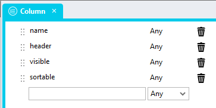

### State
The state of the DataGrid is stored in this type
1. pageSize (any)
2. page (any)
3. sortDirection (any)
4. sortField (any)

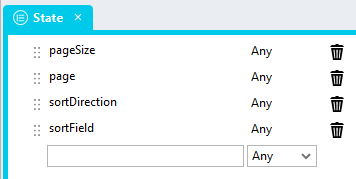

### DataSet
This type will be used in the *Repeater* *ListItem Type* property. The "DataSet" type must contain properties for all columns the DataGrid you create (visible and hidden). 

The "DataSet" type for the sample application as the following properties
1. ID (any)
2. FirstName (any)
3. LastName (any)
4. NoOfChildren (any)
5. NoOfPets (any)
6. StartDate (any)
7. EndDate (any)
8. Healthy (any)
9. Happy (any)
10. Subscription (any)

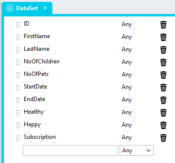

## Page
The page must contain a number of controls

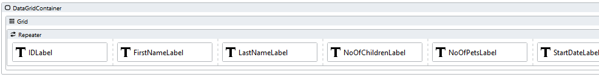

### Container
A *Container* is the wrapper for all DataGrid controls
1. Drag a *Container* control to the page and give it a suitable name (e.g. DataGridContainer)
3. Add a class of your choice to the control *Classes* property to uniquely identify the control in the application (e.g. client-side-datagrid)

### Grid
A *Grid* control will create the DataGrid rows and columns
1. Drag a *Grid* control into the *Container* control

### Repeater
A *Repeater* control will contain the data (rows) in the DataGrid
1. Drag a *Repeater* control into the *Grid* control
2. Assign the "DataSet" *Type* to the *Repeater* *ListItem Type* property

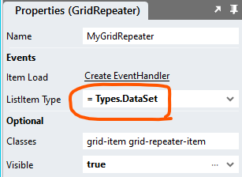

### Labels
*Label* controls in the *Repeater* represent the columns in the DataGrid
1. For each column (field) in your DataSet
   1. Drag a *Label* control into the *Repeater*
   2. Name the *Label* "*ColumnName*Label"
   3. In the *Label* *Text* property, select the corresponding *Repeater ListItem* property in the dropdown (see screenshot below)
   4. To hide the column, set the *Visible* property of the *Label* to "false" 

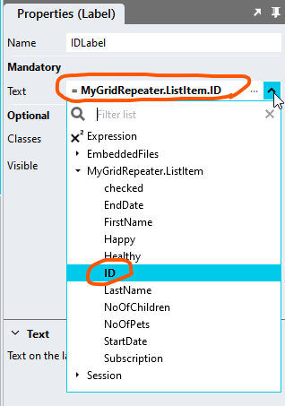

# Script Usage

## ClientSideRepeaterDataGrid

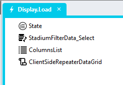

1. Open the Page.Load Event Handler
2. Execute the data source (a static list, query or a web service call)
3. Drag a `State` type into the event handler
4. Provide the load parameters for the DataGrid

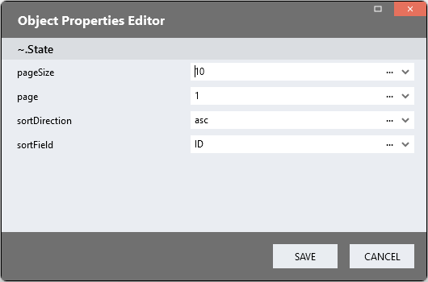

**Example**

```json
{
	"pageSize": "10",
	"page": "1",
	"sortDirection": "asc",
	"sortField": "ID"
}
```

4. Drag a *List* into the script and assign the type "Column" to the *List*
5. Add each control / column in your *Repeater* to the *List* by providing the following
   1. name (required & unique): The column name (case sensitive)
   2. header (optional): The header title shown on this column. A value is necessary for users to be able to sort by the column
   3. visible (optional): Add "false" to hide the column (default is true)
   4. sortable (optional): Add "false" to show the heading as an (unclickable) *Label* instead of a *Link* (default is true)

**Example ColumnsList Value**
```json
[{
 "name": "ID",
 "header": "ID"
},{
 "name": "FirstName",
 "header": "First Name",
 "sortable": false
},{
 "name": "LastName",
 "header": "Last Name",
 "visible": false
},{
 "name": "NoOfChildren",
 "header": "Children"
},{
 "name": "NoOfPets",
 "header": "Pets"
},{
 "name": "StartDate",
 "header": "Start Date"
},{
 "name": "EndDate",
 "header": "End Date"
},{
 "name": "Healthy",
 "header": "Healthy"
},{
 "name": "Happy",
 "header": "Happy"
},{
 "name": "Subscription",
 "header": "Subscription"
}]
```

5. Drag the "ClientSideRepeaterDataGrid" script into the "Initialise" script and provide the input parameters
   1. RepeaterControlName: The name of the *Repeater* control from the Stadium Designer properties

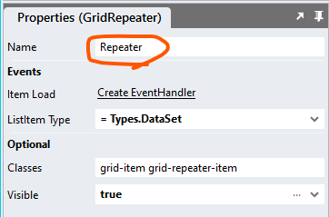

   2. Columns: The *List* of columns called "ColumnsList"
   3. ContainerClass: The unique class you assigned to the main container (e.g. client-side-datagrid)
   4. Data: Select the query *Result* or assign the JSON array to display from the API call
   5. State: The "State" *Type* created in step 1 of the "Initialise" script
   6. PagingType (optional): Supported values are
      1. 'default', the default for the Repeater DataGrid
      2. 'classic', the standard Stadium DataGrid paging format
      3. 'infinite', for infinite scrolling instead of paging
   7. Callback (optional): Leave blank or add the name of a page script that will be called after the assignment of the data

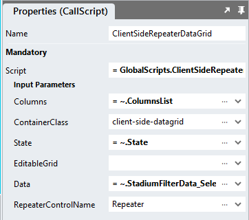

## ClientSideRepeaterDataGridState 

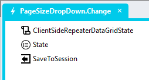

Reinstating a DataGrid to a previous setting can be achieved by saving the state of that DataGrid when users affect changes, such as sorting, paging or changing the page size. The state of a DataGrid can be retreived by calling the 'ClientSideRepeaterDataGridState' script. It returns an object containing the state of the DataGrid. This can then be used to reinstate that state later. 

1. Drag the 'ClientSideRepeaterDataGridState' script to an event handler or script and provide the input parameters
   1. ContainerClass: The classname of the container
2. Drag a 'State' type to the script and assign the return value to the type `Value` property

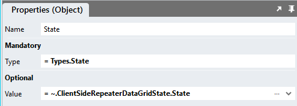

3. Save the state in an application `Session` variable or use the [Application Variables](https://github.com/stadium-software/utils-body-variables) or [Page Variables](https://github.com/stadium-software/utils-page-variables) repos to store the value

## ClientSideRepeaterDataGridGetData

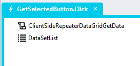

The `Repeater.List` property contains only the data shown in the displayed DataGrid page. To retreive the entire dataset from the DataGrid, it is necessary to use the 'ClientSideRepeaterDataGridGetData' script. 

1. Drag the 'ClientSideRepeaterDataGridGetData' script to an event handler or script
2. Drag a `List` action to the script 
3. Assign the 'DataSet' type to the list
4. Assign the `data` property of the returned object to the `List` (ClientSideRepeaterDataGridGetData.data)

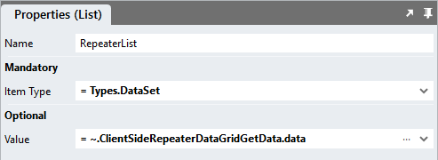

Note: This function currently only supports the use of one DataGrid per page

# CSS
Variables exposed in the [*stadium-client-side-repeater-datagrid-variables.css*](stadium-client-side-repeater-datagrid-variables.css) file can be customised.

1. Open the CSS file called [*stadium-client-side-repeater-datagrid-variables.css*](stadium-client-side-repeater-datagrid-variables.css) from this repo
2. Adjust the variables in the *:root* element as you see fit
3. Stadium 6.12+ users can comment out any variable they do **not** want to customise
4. Add the [*stadium-client-side-repeater-datagrid-variables.css*](stadium-client-side-repeater-datagrid-variables.css) to the "CSS" folder in the EmbeddedFiles (overwrite)
5. Paste the link tag below into the *head* property of your application (if you don't already have it there)
```html
<link rel="stylesheet" href="{EmbeddedFiles}/CSS/stadium-client-side-repeater-datagrid-variables.css">
``` 
6. Add the file to the "CSS" inside of your Embedded Files in your application

# Optional Features
Review the sample application in this repo to familiarise yourself with the following optional features available in this DataGrid implementation.

1. CallBack script - performing actions after the user has sorted or paged the DataGrid
2. Classic paging - the standard Stadium DataGrid paging format
3. Column editing - using input controls in the Repeater to edit data directly in the DataGrid
4. Conditional cell formatting - using a Repeater.Item.Load event to attach classes to Repeater cells based on data values
5. Custom filters - creating custom filter controls to filter the Repeater data
6. Custom load params - loading a page with custom load parameters (e.g. page size, sort field and sort direction)
7. Data export - exporting the entire Repeater dataset to CSV format
8. Editable grid - making the Repeater editable with input controls in the Repeater and saving the changes back to the data source
9. Hidden columns - hiding columns in the Repeater
10. Icon columns - using icons in Repeater columns
11. Link columns - showing links in Repeater columns
12. Multi-column editing - editing multiple columns in the Repeater
13. Page loader - showing a page loader while the Repeater is loading data
14. Row menu - adding a context menu to each row in the Repeater
15. Selectable rows - displaying a checkbox column to select rows in the Repeater
16. Settable page size - allowing users to select the number of rows shown
17. Simple tooltips - adding tooltips to Repeater cells

# Upgrading Stadium Repos
Stadium Repos are not static. They change as additional features are added and bugs are fixed. Using the right method to work with Stadium Repos allows for upgrading them in a controlled manner. 

How to use and update application repos is described here: [Working with Stadium Repos](https://github.com/stadium-software/samples-upgrading)